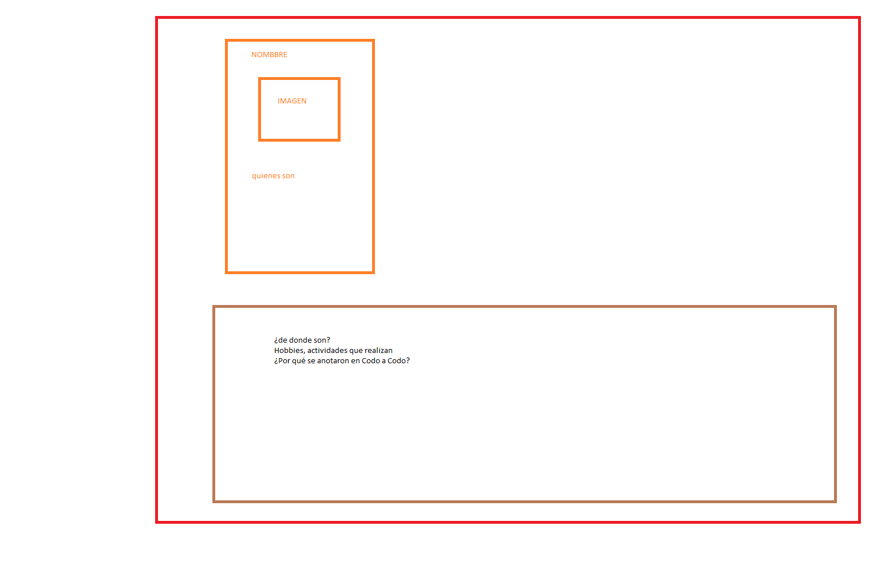
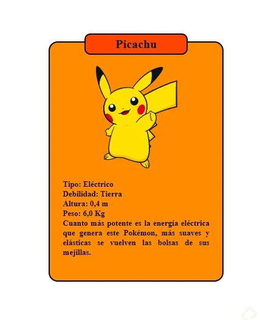

# CaCNodeJSEjCard
#Desafio Presentación personal

En este repositorio se encuentra la entrega del ejercicio de la tarjeta y la presentación personal de la comisión #23577 del curso FrontEnd NodeJS del programa Codo a Codo.

[Detalles del desafío el drive del profe](https://drive.google.com/drive/folders/1wXoScQkKOyxo04d7XyQKgloek6CvlVQb)

## Detalles del desafío:
[Para más detalles ver el drive del profe](https://drive.google.com/drive/folders/1wXoScQkKOyxo04d7XyQKgloek6CvlVQb)
### Resumen del desafio
---
>Desafío #1 - HTML y CSS
> 1. Deberán crear una página en html con una breve presentación personal
>   - ¿Quiénes son?
>   - ¿de donde son?
>   - Hobbies, actividades que realizan
>   - ¿Por qué se anotaron en Codo a Codo?
> 2. Vincular una hoja de estilos css y cambiar el color a mis títulos y párrafos.
>
>Deberán realizar la pagina con todo lo visto hasta el dia de la fecha
---
Modelo de la página HTML que se debe entregar:

Dentro de la página de presentación se debe crear una tarjeta con detalles del alumno siguiendo el modelo de esta tarjeta:

---